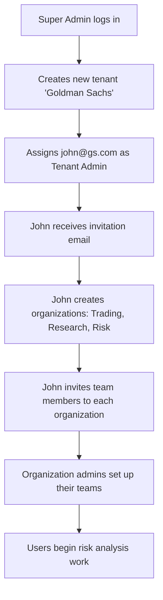
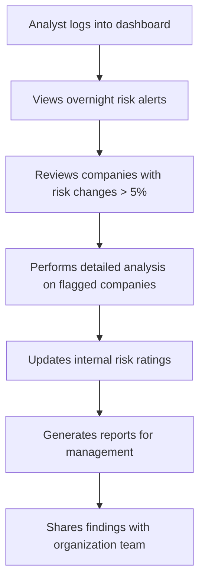
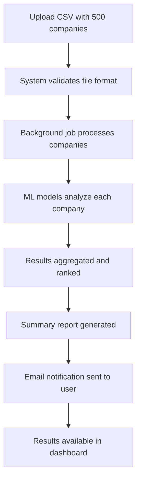

# 🚀 Default Rate Management Platform - Comprehensive Application Guide

## 📋 Application Overview

**Default Rate Management Platform** is a comprehensive **multi-tenant SaaS application** built with **Next.js 15.5.3** and **TypeScript** that provides financial risk analysis and company default probability predictions using machine learning models. The platform serves financial institutions, investment firms, and credit analysts who need to assess corporate credit risk.

## � High-Level System Overview

### **System Components**
```
┌─────────────────────────────────────────────────────────────────────────────────────┐
│                           DEFAULT RATE MANAGEMENT PLATFORM                         │
├─────────────────────────────────────────────────────────────────────────────────────┤
│                                                                                     │
│  🌐 Frontend (Client-Side)          📡 Backend (Server-Side)                       │
│  ┌─────────────────────────┐        ┌─────────────────────────────────────────┐    │
│  │  Next.js 15.5.3         │  HTTP  │  FastAPI (Python 3.13)                │    │
│  │  ├─ React Components    │ ────── │  ├─ REST API Endpoints                │    │
│  │  ├─ TypeScript          │  HTTPS │  ├─ Authentication (JWT RS256)        │    │
│  │  ├─ Tailwind CSS        │        │  ├─ Role-based Authorization          │    │
│  │  ├─ Zustand State Mgmt  │        │  ├─ Multi-tenant Data Isolation      │    │
│  │  └─ TanStack Query      │        │  └─ Business Logic Layer              │    │
│  └─────────────────────────┘        └─────────────────────────────────────────┘    │
│                                                                                     │
│  💾 Data Layer                      🤖 ML/AI Layer                                 │
│  ┌─────────────────────────┐        ┌─────────────────────────────────────────┐    │
│  │  PostgreSQL 15          │        │  Machine Learning Pipeline             │    │
│  │  ├─ Tenant Isolation    │        │  ├─ Random Forest Model               │    │
│  │  ├─ ACID Transactions   │        │  ├─ Gradient Boosting Model           │    │
│  │  ├─ Complex Queries     │        │  ├─ Logistic Regression Model         │    │
│  │  └─ Data Relationships  │        │  ├─ Feature Engineering               │    │
│  └─────────────────────────┘        │  └─ Real-time Prediction Engine       │    │
│                                     └─────────────────────────────────────────┘    │
│  ⚡ Caching Layer                   ⚙️ Background Processing                        │
│  ┌─────────────────────────┐        ┌─────────────────────────────────────────┐    │
│  │  Redis 7                │        │  Celery Task Queue                     │    │
│  │  ├─ Session Storage     │        │  ├─ Bulk Company Analysis              │    │
│  │  ├─ API Response Cache  │        │  ├─ Report Generation                 │    │
│  │  ├─ ML Model Cache      │        │  ├─ Data Import/Export                │    │
│  │  └─ Real-time Updates   │        │  └─ Scheduled Jobs                    │    │
│  └─────────────────────────┘        └─────────────────────────────────────────┘    │
└─────────────────────────────────────────────────────────────────────────────────────┘
```

### **Data Flow Architecture**
```
┌─────────────┐    ┌─────────────┐    ┌─────────────┐    ┌─────────────┐
│   Browser   │    │  Next.js    │    │  FastAPI    │    │ PostgreSQL  │
│  (Client)   │    │ Frontend    │    │  Backend    │    │  Database   │
└──────┬──────┘    └──────┬──────┘    └──────┬──────┘    └──────┬──────┘
       │                  │                  │                  │
       │  User Action     │                  │                  │
       ├─────────────────→│                  │                  │
       │                  │  API Request     │                  │
       │                  ├─────────────────→│                  │
       │                  │                  │  SQL Query       │
       │                  │                  ├─────────────────→│
       │                  │                  │  Query Result    │
       │                  │                  │←─────────────────┤
       │                  │  JSON Response   │                  │
       │                  │←─────────────────┤                  │
       │  UI Update       │                  │                  │
       │←─────────────────┤                  │                  │
       │                  │                  │                  │
       
       ┌─────────────┐    ┌─────────────┐    ┌─────────────┐
       │   Redis     │    │   Celery    │    │   ML APIs   │
       │   Cache     │    │   Tasks     │    │  Pipeline   │
       └──────┬──────┘    └──────┬──────┘    └──────┬──────┘
              │                  │                  │
              │  Cache Hit/Miss  │  Background Job  │  ML Prediction
              │←────────────────→│←────────────────→│←──────────────→
```

## �🏗️ System Architecture

## 🏗️ System Architecture

### **Detailed Architecture Design**

```
┌─────────────────────────────────────────────────────────────────────────────────────────────────────────┐
│                                    SYSTEM ARCHITECTURE LAYERS                                              │
├─────────────────────────────────────────────────────────────────────────────────────────────────────────┤
│                                                                                                             │
│ 🌐 PRESENTATION LAYER (Client-Side)                                                                        │
│ ┌─────────────────────────────────────────────────────────────────────────────────────────────────────┐ │
│ │  Next.js 15.5.3 Application (TypeScript)                                                             │ │
│ │  ┌─────────────────┐  ┌─────────────────┐  ┌─────────────────┐  ┌─────────────────────────────────┐ │ │
│ │  │  🎨 UI Layer    │  │  🧠 State Mgmt  │  │  📡 API Layer   │  │  🛡️ Auth & Guards              │ │ │
│ │  │                 │  │                 │  │                 │  │                                 │ │ │
│ │  │ • shadcn/ui     │  │ • Zustand Store │  │ • Axios Client  │  │ • JWT Token Management         │ │ │
│ │  │ • Tailwind CSS  │  │ • TanStack      │  │ • API Routes    │  │ • Role-based Route Guards      │ │ │
│ │  │ • Lucide Icons  │  │   Query         │  │ • Error         │  │ • Auto Token Refresh           │ │ │
│ │  │ • Responsive    │  │ • Form State    │  │   Handling      │  │ • Session Management           │ │ │
│ │  │   Design        │  │ • Cache Mgmt    │  │ • Request       │  │ • Auth Context Provider        │ │ │
│ │  │                 │  │                 │  │   Interceptors  │  │                                 │ │ │
│ │  └─────────────────┘  └─────────────────┘  └─────────────────┘  └─────────────────────────────────┘ │ │
│ └─────────────────────────────────────────────────────────────────────────────────────────────────────┘ │
│                                                                                                             │
│ ⚙️ APPLICATION LAYER (Server-Side)                                                                         │
│ ┌─────────────────────────────────────────────────────────────────────────────────────────────────────┐ │
│ │  FastAPI Backend (Python 3.13)                                                                       │ │
│ │  ┌─────────────────┐  ┌─────────────────┐  ┌─────────────────┐  ┌─────────────────────────────────┐ │ │
│ │  │  🌐 API Gateway │  │  🔒 Auth Layer  │  │  🏢 Business    │  │  📊 ML/AI Services              │ │ │
│ │  │                 │  │                 │  │     Logic       │  │                                 │ │ │
│ │  │ • REST          │  │ • JWT RS256     │  │                 │  │ • Ensemble Models               │ │ │
│ │  │   Endpoints     │  │ • RBAC System   │  │ • Multi-tenant  │  │ • Feature Engineering          │ │ │
│ │  │ • Request       │  │ • Permission    │  │   Logic         │  │ • Real-time Predictions         │ │ │
│ │  │   Validation    │  │   Matrix        │  │ • Data          │  │ • Model Performance             │ │ │
│ │  │ • Error         │  │ • Role          │  │   Validation    │  │   Monitoring                    │ │ │
│ │  │ • Rate          │  │ • Audit         │  │ • Business      │  │ • Batch Processing              │ │ │
│ │  │   Limiting      │  │   Logging       │  │   Rules         │  │ • Model Updates                 │ │ │
│ │  └─────────────────┘  └─────────────────┘  └─────────────────┘  └─────────────────────────────────┘ │ │
│ └─────────────────────────────────────────────────────────────────────────────────────────────────────┘ │
│                                                                                                             │
│ 💾 DATA LAYER                                                                                              │
│ ┌─────────────────────────────────────────────────────────────────────────────────────────────────────┐ │
│ │  ┌─────────────────┐  ┌─────────────────┐  ┌─────────────────┐  ┌─────────────────────────────────┐ │ │
│ │  │  🗄️ PostgreSQL  │  │  ⚡ Redis Cache │  │  🔄 Task Queue  │  │  📁 File Storage                │ │ │
│ │  │     Database    │  │                 │  │                 │  │                                 │ │ │
│ │  │                 │  │ • Session       │  │ • Celery        │  │ • CSV Uploads                   │ │ │
│ │  │ • Multi-tenant  │  │   Storage       │  │   Workers       │  │ • Report Files                  │ │ │
│ │  │   Data Model    │  │ • API Response  │  │ • Background    │  │ • Export Files                  │ │ │
│ │  │ • ACID          │  │   Caching       │  │   Jobs          │  │ • Logo/Assets                   │ │ │
│ │  │ • Complex       │  │ • ML Model      │  │ • Job Status    │  │ • Temp Storage                  │ │ │
│ │  │   Relations     │  │   Cache         │  │   Tracking      │  │                                 │ │ │
│ │  │ • Data          │  │ • Real-time     │  │ • Retry Logic   │  │                                 │ │ │
│ │  │   Integrity     │  │   Updates       │  │                 │  │                                 │ │ │
│ │  └─────────────────┘  └─────────────────┘  └─────────────────┘  └─────────────────────────────────┘ │ │
│ └─────────────────────────────────────────────────────────────────────────────────────────────────────┘ │
│                                                                                                             │
│ 🌍 INFRASTRUCTURE LAYER                                                                                    │
│ ┌─────────────────────────────────────────────────────────────────────────────────────────────────────┐ │
│ │  ┌─────────────────┐  ┌─────────────────┐  ┌─────────────────┐  ┌─────────────────────────────────┐ │ │
│ │  │  🌐 Web Server  │  │  🔧 Process     │  │  📊 Monitoring  │  │  🔒 Security                    │ │ │
│ │  │                 │  │     Manager     │  │                 │  │                                 │ │ │
│ │  │ • Nginx/Apache  │  │ • Gunicorn      │  │ • Health        │  │ • HTTPS/TLS                     │ │ │
│ │  │ • Load          │  │ • PM2           │  │   Checks        │  │ • CORS Policy                   │ │ │
│ │  │   Balancing     │  │ • Auto-scaling  │  │ • Performance   │  │ • Rate Limiting                 │ │ │
│ │  │ • SSL           │  │ • Process       │  │   Metrics       │  │ • Input Validation              │ │ │
│ │  │   Termination   │  │   Monitoring    │  │ • Error         │  │ • SQL Injection Prevention      │ │ │
│ │  │ • Static        │  │ • Resource      │  │   Tracking      │  │ • XSS Protection                │ │ │
│ │  │   Assets        │  │   Management    │  │ • Alerting      │  │ • Data Encryption               │ │ │
│ │  └─────────────────┘  └─────────────────┘  └─────────────────┘  └─────────────────────────────────┘ │ │
│ └─────────────────────────────────────────────────────────────────────────────────────────────────────┘ │
└─────────────────────────────────────────────────────────────────────────────────────────────────────────┘
```

### **Component Interaction Flow**

```
┌─────────────────────────────────────────────────────────────────────────────────────────────┐
│                                  REQUEST LIFECYCLE                                             │
├─────────────────────────────────────────────────────────────────────────────────────────────┤
│                                                                                                 │
│  1️⃣ USER INTERACTION                                                                          │
│     👤 User clicks "Analyze Company" → 🎨 React Component                                     │
│                                                                                                 │
│  2️⃣ STATE MANAGEMENT                                                                          │
│     🧠 Zustand Store → 📡 TanStack Query → 🔄 Cache Check                                    │
│                                                                                                 │
│  3️⃣ API REQUEST                                                                               │
│     📡 Axios Client → 🛡️ Auth Headers → 🌐 HTTP Request                                      │
│                                                                                                 │
│  4️⃣ SERVER PROCESSING                                                                         │
│     🌐 FastAPI Router → 🔒 Auth Middleware → 🏢 Business Logic                               │
│                                                                                                 │
│  5️⃣ DATA PROCESSING                                                                           │
│     📊 ML Pipeline → 💾 Database Query → ⚡ Redis Cache                                       │
│                                                                                                 │
│  6️⃣ RESPONSE GENERATION                                                                       │
│     📄 JSON Response → 🔒 Security Headers → 📡 HTTP Response                                │
│                                                                                                 │
│  7️⃣ CLIENT UPDATE                                                                             │
│     📡 Response Handler → 🧠 State Update → 🎨 UI Re-render                                  │
│                                                                                                 │
└─────────────────────────────────────────────────────────────────────────────────────────────┘
```

### **Security Architecture**

```
┌─────────────────────────────────────────────────────────────────────────────────────────────┐
│                                   SECURITY LAYERS                                              │
├─────────────────────────────────────────────────────────────────────────────────────────────┤
│                                                                                                 │
│  🛡️ AUTHENTICATION & AUTHORIZATION                                                            │
│  ┌─────────────────────────────────────────────────────────────────────────────────────────┐ │
│  │  JWT Token Flow                                                                           │ │
│  │  ┌──────────────┐   ┌──────────────┐   ┌──────────────┐   ┌──────────────────────────┐ │ │
│  │  │   Login      │   │    JWT       │   │   Token      │   │      Role-based          │ │ │
│  │  │  Credentials │──→│  Generation  │──→│ Validation   │──→│   Authorization          │ │ │
│  │  │              │   │   (RS256)    │   │              │   │                          │ │ │
│  │  └──────────────┘   └──────────────┘   └──────────────┘   └──────────────────────────┘ │ │
│  └─────────────────────────────────────────────────────────────────────────────────────────┘ │
│                                                                                                 │
│  🔒 DATA PROTECTION                                                                            │
│  ┌─────────────────────────────────────────────────────────────────────────────────────────┐ │
│  │  ┌──────────────┐   ┌──────────────┐   ┌──────────────┐   ┌──────────────────────────┐ │ │
│  │  │   Input      │   │    Data      │   │   Database   │   │      API Response        │ │ │
│  │  │ Validation   │   │ Encryption   │   │ Encryption   │   │    Sanitization          │ │ │
│  │  │              │   │              │   │              │   │                          │ │ │
│  │  │ • SQL        │   │ • TLS 1.3    │   │ • At Rest    │   │ • Sensitive Data         │ │ │
│  │  │   Injection  │   │ • Field      │   │ • In Transit │   │ • Header Security        │ │ │
│  │  │ • XSS        │   │   Level      │   │ • Backup     │   │ • CORS Policy            │ │ │
│  │  │ • CSRF       │   │   Encryption │   │   Encryption │   │ • Rate Limiting          │ │ │
│  │  └──────────────┘   └──────────────┘   └──────────────┘   └──────────────────────────┘ │ │
│  └─────────────────────────────────────────────────────────────────────────────────────────┘ │
│                                                                                                 │
│  📊 AUDIT & MONITORING                                                                         │
│  ┌─────────────────────────────────────────────────────────────────────────────────────────┐ │
│  │  ┌──────────────┐   ┌──────────────┐   ┌──────────────┐   ┌──────────────────────────┐ │ │
│  │  │   Access     │   │   Security   │   │   Anomaly    │   │      Compliance          │ │ │
│  │  │   Logging    │   │   Events     │   │  Detection   │   │     Reporting            │ │ │
│  │  │              │   │              │   │              │   │                          │ │ │
│  │  │ • User       │   │ • Failed     │   │ • Unusual    │   │ • GDPR                   │ │ │
│  │  │   Actions    │   │   Logins     │   │   Access     │   │ • SOC 2                  │ │ │
│  │  │ • Data       │   │ • Permission │   │   Patterns   │   │ • PCI DSS                │ │ │
│  │  │   Access     │   │   Changes    │   │ • Rate       │   │ • Audit Trails           │ │ │
│  │  │ • System     │   │ • Admin      │   │   Limiting   │   │                          │ │ │
│  │  │   Changes    │   │   Actions    │   │   Triggers   │   │                          │ │ │
│  │  └──────────────┘   └──────────────┘   └──────────────┘   └──────────────────────────┘ │ │
│  └─────────────────────────────────────────────────────────────────────────────────────────┘ │
└─────────────────────────────────────────────────────────────────────────────────────────────┘
```

### **Multi-Tenant Data Architecture**

```
┌─────────────────────────────────────────────────────────────────────────────────────────────┐
│                               TENANT ISOLATION MODEL                                           │
├─────────────────────────────────────────────────────────────────────────────────────────────┤
│                                                                                                 │
│  DATABASE SCHEMA DESIGN                                                                        │
│  ┌─────────────────────────────────────────────────────────────────────────────────────────┐ │
│  │                                                                                           │ │
│  │    🏢 TENANT_A                🏢 TENANT_B                🏢 TENANT_C                    │ │
│  │    ┌─────────────────┐       ┌─────────────────┐       ┌─────────────────┐             │ │
│  │    │  Organizations  │       │  Organizations  │       │  Organizations  │             │ │
│  │    │  ┌─────────────┐│       │  ┌─────────────┐│       │  ┌─────────────┐│             │ │
│  │    │  │   Org 1     ││       │  │   Org 1     ││       │  │   Org 1     ││             │ │
│  │    │  │ ┌─────────┐ ││       │  │ ┌─────────┐ ││       │  │ ┌─────────┐ ││             │ │
│  │    │  │ │ Users   │ ││       │  │ │ Users   │ ││       │  │ │ Users   │ ││             │ │
│  │    │  │ │ Data    │ ││       │  │ │ Data    │ ││       │  │ │ Data    │ ││             │ │
│  │    │  │ │ Reports │ ││       │  │ │ Reports │ ││       │  │ │ Reports │ ││             │ │
│  │    │  │ └─────────┘ ││       │  │ └─────────┘ ││       │  │ └─────────┘ ││             │ │
│  │    │  │   Org 2     ││       │  │   Org 2     ││       │  │   Org 2     ││             │ │
│  │    │  │ ┌─────────┐ ││       │  │ ┌─────────┐ ││       │  │ ┌─────────┐ ││             │ │
│  │    │  │ │ Users   │ ││       │  │ │ Users   │ ││       │  │ │ Users   │ ││             │ │
│  │    │  │ │ Data    │ ││       │  │ │ Data    │ ││       │  │ │ Data    │ ││             │ │
│  │    │  │ │ Reports │ ││       │  │ │ Reports │ ││       │  │ │ Reports │ ││             │ │
│  │    │  │ └─────────┘ ││       │  │ └─────────┘ ││       │  │ └─────────┘ ││             │ │
│  │    │  └─────────────┘│       │  └─────────────┘│       │  └─────────────┘│             │ │
│  │    └─────────────────┘       └─────────────────┘       └─────────────────┘             │ │
│  │                                                                                           │ │
│  │    🔒 COMPLETE DATA ISOLATION - No Cross-Tenant Access                                   │ │
│  │                                                                                           │ │
│  └─────────────────────────────────────────────────────────────────────────────────────────┘ │
│                                                                                                 │
│  PERMISSION MATRIX                                                                             │
│  ┌─────────────────────────────────────────────────────────────────────────────────────────┐ │
│  │  Role            │ Own Data │ Org Data │ Tenant Data │ Platform Data │ Global Data       │ │
│  │  ────────────────┼──────────┼──────────┼─────────────┼───────────────┼─────────────────  │ │
│  │  👑 Super Admin  │    ✅     │    ✅     │      ✅      │       ✅       │        ✅         │ │
│  │  🏢 Tenant Admin │    ✅     │    ✅     │      ✅      │       ❌       │        🔍         │ │
│  │  🏛️ Org Admin    │    ✅     │    ✅     │      ❌      │       ❌       │        🔍         │ │
│  │  👥 Org Member   │    ✅     │    🔍     │      ❌      │       ❌       │        🔍         │ │
│  │  👤 Individual   │    ✅     │    ❌     │      ❌      │       ❌       │        🔍         │ │
│  │                                                                                           │ │
│  │  Legend: ✅ = Full Access, 🔍 = Read Only, ❌ = No Access                                 │ │
│  └─────────────────────────────────────────────────────────────────────────────────────────┘ │
└─────────────────────────────────────────────────────────────────────────────────────────────┘
```
```
Platform
├── 👑 Super Admin (Platform Owner)
│   ├── 🏢 Tenant 1 (Financial Institution A)
│   │   ├── 🏛️ Organization 1 (Investment Division)
│   │   │   ├── 👥 Org Admin (Division Manager)
│   │   │   ├── 👤 Org Member (Senior Analyst)
│   │   │   └── 👤 Org Member (Junior Analyst)
│   │   └── 🏛️ Organization 2 (Credit Risk Division)
│   │       ├── 👥 Org Admin (Risk Manager)
│   │       └── 👤 Org Member (Risk Analyst)
│   └── 🏢 Tenant 2 (Financial Institution B)
│       └── 🏛️ Organization 1 (Research Department)
│           └── 👥 Org Admin (Research Director)
```

## 🎭 User Roles & Permissions System

### **1. 👑 Super Admin (Platform Owner)**
**Access Level:** Complete platform control across all tenants
**Dashboard:** Super Admin Dashboard (`/super-admin-dashboard`)

**Capabilities:**
- ✅ **Platform Overview:** View system-wide metrics, uptime, API performance
- ✅ **Tenant Management:** Create, edit, delete, and monitor all tenants
- ✅ **User Management:** Manage users across all tenants and organizations
- ✅ **System Administration:** Access to platform configuration and settings
- ✅ **Create Tenant with Admin:** One-click tenant setup with designated admin user
- ✅ **View All Data:** Access to all predictions, companies, and analytics globally

**Example Workflow:**
```
Super Admin Sarah logs in →
1. Views platform overview (500 users, 50 tenants, 99.9% uptime)
2. Creates new tenant "Goldman Sachs" with tenant admin john@gs.com
3. Monitors system performance and user activity
4. Manages platform-wide user permissions
```

### **2. 🏢 Tenant Admin (Multi-Organization Manager)**
**Access Level:** Complete control within their assigned tenant
**Dashboard:** Settings page with Tenant Admin Management tab

**Capabilities:**
- ✅ **Organization Management:** Create, edit, delete organizations within their tenant
- ✅ **Cross-Org User Management:** Assign users between organizations in their tenant
- ✅ **Org Admin Assignment:** Assign users as organization administrators
- ✅ **Tenant-Scoped Analytics:** View aggregated data across all tenant organizations
- ✅ **User Invitations:** Invite users to join organizations within their tenant
- ✅ **Organization Settings:** Configure organization permissions and settings

**Example Workflow:**
```
Tenant Admin Mike at "JP Morgan" logs in →
1. Views tenant overview (3 organizations, 45 users)
2. Creates new organization "Fixed Income Trading"
3. Assigns Alice as org admin for the new organization
4. Invites 10 traders to join the Fixed Income Trading organization
5. Views consolidated risk reports across all JP Morgan organizations
```

### **3. 🏛️ Org Admin (Single Organization Manager)**
**Access Level:** Complete control within their specific organization
**Dashboard:** Settings page with Organization Admin Management tab

**Capabilities:**
- ✅ **Organization User Management:** Invite, remove, and manage users in their org
- ✅ **User Role Management:** Promote org members to other roles within organization
- ✅ **Organization Analytics:** View organization-specific predictions and reports
- ✅ **Company Analysis:** Access to organization's company risk assessments
- ✅ **Bulk Operations:** Upload and analyze multiple companies at once
- ✅ **Organization Settings:** Configure org preferences and data access

**Example Workflow:**
```
Org Admin Jennifer at "Credit Risk Division" logs in →
1. Views organization dashboard (12 members, 150 companies analyzed)
2. Invites new risk analyst bob@company.com to join organization
3. Reviews latest default probability predictions for portfolio companies
4. Uploads bulk CSV of 50 new companies for risk assessment
5. Generates monthly risk report for management
```

### **4. 👥 Org Member (Organization User)**
**Access Level:** Organization data access with member privileges
**Dashboard:** Main dashboard with organization-scoped data

**Capabilities:**
- ✅ **Company Analysis:** Analyze individual companies and view predictions
- ✅ **Risk Reports:** Generate and view risk assessments for portfolio companies
- ✅ **Data Visualization:** Access charts, graphs, and analytics dashboards
- ✅ **Custom Analysis:** Create custom risk models and scenarios
- ✅ **Export Data:** Download reports and analysis results
- ✅ **Organization Data Access:** View shared company databases within org

**Example Workflow:**
```
Org Member David (Senior Analyst) logs in →
1. Views dashboard with organization's 150 tracked companies
2. Analyzes Apple Inc. default probability (Current: 2.3% - Low Risk)
3. Reviews quarterly predictions showing trend improvements
4. Creates custom analysis comparing tech sector risks
5. Exports monthly portfolio risk report for his manager
```

### **5. 👤 Individual User (No Organization)**
**Access Level:** Personal account with global data access
**Dashboard:** Main dashboard with global + personal data

**Capabilities:**
- ✅ **Personal Analysis:** Analyze companies and save personal predictions
- ✅ **Global Data Access:** View publicly available company information
- ✅ **Join Organizations:** Use join tokens to join organizations
- ✅ **Individual Predictions:** Create and manage personal risk assessments
- ✅ **Limited Features:** Basic analysis tools without organization resources

**Example Workflow:**
```
Individual User Lisa (Freelance Analyst) logs in →
1. Views public company database with basic information
2. Analyzes Tesla Inc. using available public financial data
3. Saves personal prediction and notes for future reference
4. Receives invitation to join "Investment Research Corp"
5. Uses join token XYZ123 to join organization as member
```

## 🎯 Core Application Features

### **1. 📊 Company Risk Analysis Engine**
- **ML-Powered Predictions:** Advanced ensemble models predict default probabilities
- **Real-time Analysis:** Instant risk assessment for any public company
- **Historical Tracking:** Monitor risk changes over time with trend analysis
- **Risk Categories:** Automated classification (Low, Medium, High, Critical risk)
- **Financial Ratios:** Comprehensive ratio analysis with industry benchmarks

### **2. 📈 Advanced Analytics Dashboard**
- **Interactive Charts:** Real-time visualizations of risk metrics and trends
- **Portfolio Overview:** Aggregate risk assessment across multiple companies  
- **Comparative Analysis:** Side-by-side company risk comparisons
- **Custom Reports:** Generate tailored reports for specific use cases
- **Data Export:** Export analysis to Excel, PDF, and CSV formats

### **3. 🔄 Bulk Processing System**
- **CSV Upload:** Batch analyze hundreds of companies simultaneously
- **Background Jobs:** Asynchronous processing with real-time progress tracking
- **Automated Reports:** Bulk analysis results with summary statistics
- **Error Handling:** Detailed error reporting for failed analyses
- **Queue Management:** Priority processing for urgent analysis requests

### **4. 👥 Collaboration Tools**
- **Organization Sharing:** Share analysis results within organization
- **User Invitations:** Email-based invitations with role assignments
- **Team Analytics:** Collaborative analysis and reporting features
- **Access Control:** Granular permissions for data sharing
- **Activity Tracking:** Audit logs of user actions and data access

## 🛡️ Security & Access Control

### **Authentication System**
- **JWT Tokens:** Secure authentication with RS256 encryption
- **Role-Based Access:** 5-tier permission system with granular controls
- **Session Management:** Automatic token refresh and secure logout
- **Multi-Factor Support:** Ready for MFA implementation

### **Data Isolation**
- **Tenant Separation:** Complete data isolation between tenants
- **Organization Boundaries:** Secure data sharing within organizations
- **Permission Matrix:** Detailed access controls for each user role
- **Audit Logging:** Comprehensive tracking of all user activities

## 🔧 Technical Stack

### **Frontend (Next.js 15.5.3)**
- **Framework:** Next.js with App Router and Turbopack
- **Language:** TypeScript for type safety and better development experience
- **Styling:** Tailwind CSS with shadcn/ui component library
- **State Management:** Zustand for client-side state management
- **Data Fetching:** TanStack Query for server state management
- **Charts:** Advanced data visualization with interactive charts

### **Backend Integration**
- **API:** RESTful API built with FastAPI (Python 3.13)
- **Database:** PostgreSQL 15 with SQLAlchemy 2.0
- **Cache:** Redis 7 for performance optimization
- **ML Pipeline:** Ensemble models for accurate risk prediction
- **Background Jobs:** Celery for asynchronous task processing

## 📱 User Interface Examples

### **Super Admin Dashboard**
```
┌─────────────────────────────────────────────────────────────┐
│ 🏗️ Platform Overview                            👑 Super Admin │
├─────────────────────────────────────────────────────────────┤
│ 📊 System Metrics                                           │
│ • Total Users: 1,247        • Active Tenants: 23          │
│ • API Calls: 45,231         • System Uptime: 99.9%        │
│                                                            │
│ 🏢 Recent Activity                                         │
│ • New tenant created: "Bank of America"                   │
│ • User registered: john.doe@boa.com                       │
│ • System maintenance completed                             │
│                                                            │
│ [Create Tenant] [Manage Users] [System Settings]          │
└─────────────────────────────────────────────────────────────┘
```

### **Tenant Admin Interface**
```
┌─────────────────────────────────────────────────────────────┐
│ 🏢 JP Morgan Chase - Tenant Management          🏢 Tenant Admin │
├─────────────────────────────────────────────────────────────┤
│ 🏛️ Organizations (4)                                        │
│ ┌─────────────────┬──────────┬─────────┬─────────────────┐   │
│ │ Investment Bank │ 23 users │ Active  │ [Edit] [Assign] │   │
│ │ Credit Risk     │ 18 users │ Active  │ [Edit] [Assign] │   │
│ │ Private Wealth  │ 15 users │ Active  │ [Edit] [Assign] │   │
│ │ Corporate Bank  │ 31 users │ Active  │ [Edit] [Assign] │   │
│ └─────────────────┴──────────┴─────────┴─────────────────┘   │
│                                                            │
│ [+ Create Organization] [Bulk Import Users]                │
└─────────────────────────────────────────────────────────────┘
```

### **Org Admin Dashboard**
```
┌─────────────────────────────────────────────────────────────┐
│ 🏛️ Investment Banking Division              👥 Organization Admin │
├─────────────────────────────────────────────────────────────┤
│ 📊 Portfolio Overview                                       │
│ • Companies Tracked: 156    • High Risk: 12               │
│ • Team Members: 23         • Recent Analysis: 45          │
│                                                            │
│ 👥 Team Management                                         │
│ • Senior Analysts: 8       • Junior Analysts: 12          │
│ • Pending Invites: 3       • Recent Activity: 156 actions │
│                                                            │
│ 📈 Recent Risk Analysis                                    │
│ • Apple Inc: 2.1% (↓ 0.3%)  • Microsoft: 1.8% (→)       │
│ • Tesla Inc: 8.4% (↑ 1.2%)  • Amazon: 3.2% (↓ 0.1%)     │
│                                                            │
│ [Invite Members] [Bulk Analysis] [Generate Report]        │
└─────────────────────────────────────────────────────────────┘
```

### **Main Analytics Dashboard**
```
┌─────────────────────────────────────────────────────────────┐
│ 📊 Risk Analytics Dashboard                    👤 Senior Analyst │
├─────────────────────────────────────────────────────────────┤
│ 📈 Portfolio Risk Trend                                    │
│     High │ ████████████                                    │
│   Medium │ ████████████████████                            │
│      Low │ ████████████████████████████████                │
│          └────────────────────────────────────────────    │
│                    Q1    Q2    Q3    Q4                   │
│                                                            │
│ 🏢 Company Analysis                                        │
│ ┌──────────────┬──────────┬─────────┬──────────────────┐   │
│ │ Tesla Inc    │   8.4%   │ High    │ [Analyze] [View] │   │
│ │ Apple Inc    │   2.1%   │ Low     │ [Analyze] [View] │   │
│ │ Microsoft    │   1.8%   │ Low     │ [Analyze] [View] │   │
│ └──────────────┴──────────┴─────────┴──────────────────┘   │
│                                                            │
│ [+ New Analysis] [📤 Export] [🔄 Refresh] [⚙️ Settings]     │
└─────────────────────────────────────────────────────────────┘
```

## 🚀 Key Workflows

### **1. Setting Up a New Financial Institution**


### **2. Daily Risk Analysis Workflow**


### **3. Bulk Company Analysis Process**


## 🎯 Real-World Use Cases

### **Use Case 1: Investment Bank Portfolio Review**
**Scenario:** JP Morgan's Investment Banking division needs weekly portfolio risk assessment

**Process:**
1. **Org Admin** sets up automated bulk analysis for 200 portfolio companies
2. **Senior Analysts** review companies with risk changes > 5%
3. **Junior Analysts** perform detailed analysis on flagged companies
4. **Team** collaborates on risk assessment using shared dashboard
5. **Management** receives executive summary with key risk metrics

### **Use Case 2: Credit Union Member Onboarding**
**Scenario:** Regional credit union wants to assess loan application risks

**Process:**
1. **Super Admin** creates tenant "Community Credit Union"
2. **Tenant Admin** creates organization "Loan Department"
3. **Org Admin** invites loan officers and underwriters
4. **Loan Officers** use platform to analyze business loan applicants
5. **Underwriters** review analysis and make approval decisions

### **Use Case 3: Independent Financial Advisor**
**Scenario:** Freelance advisor needs basic company risk information

**Process:**
1. **Individual User** signs up for personal account
2. **User** analyzes clients' investment holdings using global data
3. **User** creates personal risk assessments and notes
4. **User** exports analysis for client presentations
5. **Later:** User joins established firm's organization for enhanced features

## 🔮 Advanced Features

### **Machine Learning Integration**
- **Ensemble Models:** Random Forest + Gradient Boosting + Logistic Regression
- **Real-time Scoring:** Instant default probability calculations
- **Feature Engineering:** Advanced financial ratio analysis
- **Model Performance:** Continuous monitoring and model updates
- **Industry Benchmarks:** Sector-specific risk comparisons

### **Data Management**
- **Company Database:** Comprehensive database of public companies
- **Financial Data Integration:** Real-time financial data updates
- **Historical Analysis:** Multi-year trend analysis and predictions
- **Data Quality:** Automated data validation and cleansing
- **Custom Fields:** User-defined data points and metrics

### **Reporting & Export**
- **Custom Reports:** Flexible report builder with multiple formats
- **Scheduled Reports:** Automated daily/weekly/monthly reports
- **Dashboard Sharing:** Share live dashboards with stakeholders
- **API Access:** Programmatic access to prediction data
- **Integration Ready:** Webhooks and API for third-party integration

This comprehensive platform serves as a complete enterprise solution for financial risk management, providing the tools and insights needed for informed credit and investment decisions across organizations of all sizes.

## 📦 Deployment and Scalability Architecture

### **Deployment Architecture**

```
┌─────────────────────────────────────────────────────────────────────────────────────────────┐
│                              PRODUCTION DEPLOYMENT                                             │
├─────────────────────────────────────────────────────────────────────────────────────────────┤
│                                                                                                 │
│  🌐 CDN & EDGE LAYER                                                                          │
│  ┌─────────────────────────────────────────────────────────────────────────────────────────┐ │
│  │  CloudFlare CDN    │    Global Edge Locations    │    DDoS Protection                    │ │
│  │  • Static Assets   │    • Reduced Latency        │    • Rate Limiting                    │ │
│  │  • Image Optimization │ • Regional Caching      │    • Bot Protection                   │ │
│  │  • Compression     │    • Auto-failover          │    • SSL Termination                 │ │
│  └─────────────────────────────────────────────────────────────────────────────────────────┘ │
│                                        │                                                       │
│                                        ▼                                                       │
│  🔒 LOAD BALANCER LAYER                                                                       │
│  ┌─────────────────────────────────────────────────────────────────────────────────────────┐ │
│  │  AWS Application Load Balancer (ALB)                                                     │ │
│  │  • Health Checks           • SSL Termination        • Auto Scaling                      │ │
│  │  • Request Routing         • Session Stickiness     • Multiple AZs                      │ │
│  │  • Path-based Routing      • WebSocket Support      • Security Groups                   │ │
│  └─────────────────────────────────────────────────────────────────────────────────────────┘ │
│                                        │                                                       │
│                                        ▼                                                       │
│  🖥️ APPLICATION LAYER                                                                         │
│  ┌─────────────────────────────────────────────────────────────────────────────────────────┐ │
│  │                                                                                           │ │
│  │  Frontend (Next.js)              Backend (FastAPI)            ML Services               │ │
│  │  ┌─────────────────┐             ┌─────────────────┐         ┌─────────────────┐        │ │
│  │  │ ECS Fargate     │             │ ECS Fargate     │         │ ECS Fargate     │        │ │
│  │  │ • Auto Scaling  │             │ • Auto Scaling  │         │ • GPU Support   │        │ │
│  │  │ • Rolling       │             │ • Rolling       │         │ • Model Cache   │        │ │
│  │  │   Deploy        │             │   Deploy        │         │ • Batch Proc.   │        │ │
│  │  │ • Health Check  │             │ • Health Check  │         │ • Queue Workers │        │ │
│  │  └─────────────────┘             └─────────────────┘         └─────────────────┘        │ │
│  │           │                               │                             │                │ │
│  └───────────┼───────────────────────────────┼─────────────────────────────┼────────────────┘ │
│              │                               │                             │                  │
│              ▼                               ▼                             ▼                  │
│  💾 DATA LAYER                                                                                 │
│  ┌─────────────────────────────────────────────────────────────────────────────────────────┐ │
│  │                                                                                           │ │
│  │  Primary Database              Cache Layer                File Storage                   │ │
│  │  ┌─────────────────┐           ┌─────────────────┐       ┌─────────────────┐           │ │
│  │  │ RDS PostgreSQL  │           │ ElastiCache     │       │ S3 Buckets      │           │ │
│  │  │ • Multi-AZ      │           │ • Redis Cluster │       │ • Static Assets │           │ │
│  │  │ • Read Replicas │           │ • High Avail.   │       │ • User Uploads  │           │ │
│  │  │ • Automated     │           │ • Memory Optim. │       │ • Report Files  │           │ │
│  │  │   Backups       │           │ • Pub/Sub       │       │ • Encrypted     │           │ │
│  │  │ • Encryption    │           └─────────────────┘       │ • Versioning    │           │ │
│  │  └─────────────────┘                                     └─────────────────┘           │ │
│  │                                                                                           │ │
│  └─────────────────────────────────────────────────────────────────────────────────────────┘ │
│                                                                                                 │
│  📊 MONITORING & OBSERVABILITY                                                                │
│  ┌─────────────────────────────────────────────────────────────────────────────────────────┐ │
│  │  Metrics (CloudWatch)     │    Logging (ELK)         │    Tracing (X-Ray)              │ │
│  │  • System Metrics         │    • Application Logs    │    • Request Tracing            │ │
│  │  • Custom Metrics         │    • Error Tracking      │    • Performance Analysis       │ │
│  │  • Alerts & Dashboards    │    • Audit Trails        │    • Bottleneck Detection       │ │
│  └─────────────────────────────────────────────────────────────────────────────────────────┘ │
└─────────────────────────────────────────────────────────────────────────────────────────────┘
```

### **Scalability Architecture**

```
┌─────────────────────────────────────────────────────────────────────────────────────────────┐
│                                HORIZONTAL SCALING                                              │
├─────────────────────────────────────────────────────────────────────────────────────────────┤
│                                                                                                 │
│  📈 AUTO-SCALING GROUPS                                                                       │
│  ┌─────────────────────────────────────────────────────────────────────────────────────────┐ │
│  │                                                                                           │ │
│  │    Load Metrics          Scaling Triggers           Scaling Actions                      │ │
│  │    ┌─────────────┐      ┌─────────────────┐        ┌─────────────────────────────┐      │ │
│  │    │ CPU > 70%   │ ───→ │ Scale Out       │ ────→  │ Add 2 New Instances         │      │ │
│  │    │ Memory>80%  │      │ Scale In        │        │ Terminate Idle Instances    │      │ │
│  │    │ Queue>1000  │      │ Manual Override │        │ Update Load Balancer        │      │ │
│  │    │ Response    │      │                 │        │ Health Check New Nodes      │      │ │
│  │    │ Time>2sec   │      │                 │        │                             │      │ │
│  │    └─────────────┘      └─────────────────┘        └─────────────────────────────┘      │ │
│  │                                                                                           │ │
│  └─────────────────────────────────────────────────────────────────────────────────────────┘ │
│                                                                                                 │
│  🔄 MICROSERVICES ARCHITECTURE                                                                │
│  ┌─────────────────────────────────────────────────────────────────────────────────────────┐ │
│  │                                                                                           │ │
│  │  Service Decomposition                                                                    │ │
│  │  ┌─────────────────┐  ┌─────────────────┐  ┌─────────────────┐  ┌─────────────────┐    │ │
│  │  │ 🔒 Auth Service │  │ 👥 User Service │  │ 🏢 Tenant       │  │ 📊 Analytics    │    │ │
│  │  │                 │  │                 │  │    Service      │  │    Service      │    │ │
│  │  │ • JWT           │  │ • User CRUD     │  │ • Multi-tenant  │  │ • ML Pipeline   │    │ │
│  │  │ • Role Mgmt     │  │ • Profile Mgmt  │  │   Management    │  │ • Predictions   │    │ │
│  │  │ • Session       │  │ • Preferences   │  │ • Org Mgmt      │  │ • Reports       │    │ │
│  │  └─────────────────┘  └─────────────────┘  └─────────────────┘  └─────────────────┘    │ │
│  │           │                     │                     │                     │           │ │
│  │           └─────────────────────┼─────────────────────┼─────────────────────┘           │ │
│  │                                 │                     │                                 │ │
│  │  ┌─────────────────┐  ┌─────────────────┐  ┌─────────────────┐  ┌─────────────────┐    │ │
│  │  │ 📈 Company      │  │ 📁 File Service │  │ 📧 Notification │  │ 🔄 Job Queue    │    │ │
│  │  │    Service      │  │                 │  │    Service      │  │    Service      │    │ │
│  │  │                 │  │ • Upload/       │  │                 │  │                 │    │ │
│  │  │ • Company Data  │  │   Download      │  │ • Email Alerts  │  │ • Background    │    │ │
│  │  │ • Financial     │  │ • Processing    │  │ • In-app        │  │   Processing    │    │ │
│  │  │   Analysis      │  │ • Storage       │  │   Notifications │  │ • Task Mgmt     │    │ │
│  │  └─────────────────┘  └─────────────────┘  └─────────────────┘  └─────────────────┘    │ │
│  │                                                                                           │ │
│  └─────────────────────────────────────────────────────────────────────────────────────────┘ │
│                                                                                                 │
│  🗄️ DATABASE SCALING                                                                          │
│  ┌─────────────────────────────────────────────────────────────────────────────────────────┐ │
│  │                                                                                           │ │
│  │  Read Scaling                Write Scaling               Caching Strategy                │ │
│  │  ┌─────────────────┐        ┌─────────────────┐         ┌─────────────────────────────┐  │ │
│  │  │ Master DB       │        │ Vertical Scale  │         │ Multi-Level Caching         │  │ │
│  │  │ ┌─────────────┐ │        │ • Increase CPU  │         │ ┌─────────────────────────┐ │  │ │
│  │  │ │ Read        │ │        │ • Add Memory    │         │ │ L1: Application Cache   │ │  │ │
│  │  │ │ Replica 1   │ │        │ • SSD Storage   │         │ │ L2: Redis Cache         │ │  │ │
│  │  │ └─────────────┘ │        │                 │         │ │ L3: CDN Cache           │ │  │ │
│  │  │ ┌─────────────┐ │        │ Horizontal      │         │ │ L4: Browser Cache       │ │  │ │
│  │  │ │ Read        │ │        │ Partitioning    │         │ └─────────────────────────┘ │  │ │
│  │  │ │ Replica 2   │ │        │ • Tenant-based  │         │                             │  │ │
│  │  │ └─────────────┘ │        │ • Time-based    │         │ Cache Invalidation          │  │ │
│  │  │ ┌─────────────┐ │        │ • Geographic    │         │ • Write-through             │  │ │
│  │  │ │ Read        │ │        │   Sharding      │         │ • TTL Expiration            │  │ │
│  │  │ │ Replica N   │ │        │                 │         │ • Event-based Purging       │  │ │
│  │  │ └─────────────┘ │        └─────────────────┘         └─────────────────────────────┘  │ │
│  │  └─────────────────┘                                                                      │ │
│  │                                                                                           │ │
│  └─────────────────────────────────────────────────────────────────────────────────────────┘ │
└─────────────────────────────────────────────────────────────────────────────────────────────┘
```

### **Performance Optimization Strategy**

```
┌─────────────────────────────────────────────────────────────────────────────────────────────┐
│                              PERFORMANCE ARCHITECTURE                                          │
├─────────────────────────────────────────────────────────────────────────────────────────────┤
│                                                                                                 │
│  ⚡ FRONTEND OPTIMIZATIONS                                                                     │
│  ┌─────────────────────────────────────────────────────────────────────────────────────────┐ │
│  │  Code Splitting          │  Bundle Optimization       │  Runtime Performance            │ │
│  │  ┌─────────────────────┐ │  ┌─────────────────────┐    │  ┌─────────────────────────┐    │ │
│  │  │ • Route-based       │ │  │ • Tree Shaking      │    │  │ • React 18 Features    │    │ │
│  │  │   Splitting         │ │  │ • Dead Code         │    │  │ • Concurrent Features  │    │ │
│  │  │ • Dynamic Imports   │ │  │   Elimination       │    │  │ • Suspense Boundaries  │    │ │
│  │  │ • Component         │ │  │ • Module Federation │    │  │ • Virtual Scrolling    │    │ │
│  │  │   Lazy Loading      │ │  │ • Compression       │    │  │ • Memoization          │    │ │
│  │  │ • Asset             │ │  │   (Gzip/Brotli)    │    │  │ • Debouncing           │    │ │
│  │  │   Preloading        │ │  └─────────────────────┘    │  └─────────────────────────┘    │ │
│  │  └─────────────────────┘                              │                                  │ │
│  └─────────────────────────────────────────────────────────────────────────────────────────┘ │
│                                                                                                 │
│  🔧 BACKEND OPTIMIZATIONS                                                                     │
│  ┌─────────────────────────────────────────────────────────────────────────────────────────┐ │
│  │  Database Optimization   │  API Performance          │  Caching Strategies              │ │
│  │  ┌─────────────────────┐ │  ┌─────────────────────┐   │  ┌─────────────────────────┐    │ │
│  │  │ • Query Optimization│ │  │ • Response          │   │  │ • Query Result Cache   │    │ │
│  │  │ • Index Strategy    │ │  │   Compression       │   │  │ • API Response Cache   │    │ │
│  │  │ • Connection        │ │  │ • Pagination        │   │  │ • Session Storage      │    │ │
│  │  │   Pooling           │ │  │ • Bulk Operations   │   │  │ • ML Model Cache       │    │ │
│  │  │ • Prepared          │ │  │ • Async Processing  │   │  │ • Static Asset Cache   │    │ │
│  │  │   Statements        │ │  │ • Rate Limiting     │   │  │ • CDN Integration      │    │ │
│  │  │ • Read Replicas     │ │  └─────────────────────┘   │  └─────────────────────────┘    │ │
│  │  └─────────────────────┘                              │                                  │ │
│  └─────────────────────────────────────────────────────────────────────────────────────────┘ │
│                                                                                                 │
│  🤖 ML PIPELINE OPTIMIZATION                                                                   │
│  ┌─────────────────────────────────────────────────────────────────────────────────────────┐ │
│  │  Model Optimization      │  Prediction Caching       │  Batch Processing               │ │
│  │  ┌─────────────────────┐ │  ┌─────────────────────┐   │  ┌─────────────────────────┐    │ │
│  │  │ • Model             │ │  │ • Result Cache      │   │  │ • Queue Management     │    │ │
│  │  │   Quantization      │ │  │   (24h TTL)         │   │  │ • Priority Queues      │    │ │
│  │  │ • Feature           │ │  │ • Model Cache       │   │  │ • Parallel Processing  │    │ │
│  │  │   Engineering       │ │  │   (In-Memory)       │   │  │ • Load Balancing       │    │ │
│  │  │ • Ensemble          │ │  │ • Company Cache     │   │  │ • Error Recovery       │    │ │
│  │  │   Optimization      │ │  │   (Persistent)      │   │  │ • Progress Tracking    │    │ │
│  │  │ • GPU Acceleration  │ │  └─────────────────────┘   │  └─────────────────────────┘    │ │
│  │  └─────────────────────┘                              │                                  │ │
│  └─────────────────────────────────────────────────────────────────────────────────────────┘ │
└─────────────────────────────────────────────────────────────────────────────────────────────┘
```

### **Multi-Tenant Hierarchical Structure**
````markdown
Platform
├── 👑 Super Admin (Platform Owner)
│   ├── 🏢 Tenant 1 (Financial Institution A)
│   │   ├── 🏛️ Organization 1 (Investment Division)
│   │   │   ├── 👥 Org Admin (Division Manager)
│   │   │   ├── 👤 Org Member (Senior Analyst)
│   │   │   └── 👤 Org Member (Junior Analyst)
│   │   └── 🏛️ Organization 2 (Credit Risk Division)
│   │       ├── 👥 Org Admin (Risk Manager)
│   │       └── 👤 Org Member (Risk Analyst)
│   └── 🏢 Tenant 2 (Financial Institution B)
│       └── 🏛️ Organization 1 (Research Department)
│           └── 👥 Org Admin (Research Director)
```
